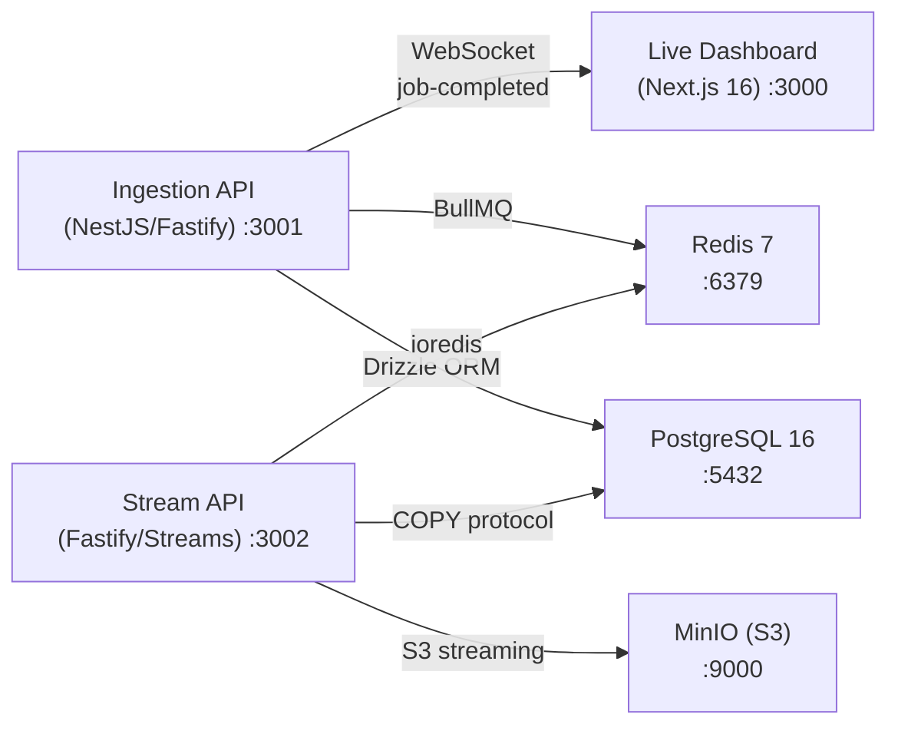

# Distributed Systems Lab

A monorepo of three interconnected production-grade systems demonstrating enterprise patterns: high-throughput webhook ingestion, real-time visualization, and memory-safe streaming data processing.

## Architecture



| System | Purpose | Key Metric |
|---|---|---|
| **Ingestion API** | Webhook ingestion with async processing | 0% errors at 500 VUs, 7.35ms P95 |
| **Live Dashboard** | Real-time RPS chart and event stream | 60 FPS under 200 VU load |
| **Stream API** | CSV bulk import via Node.js Streams | 5M rows in 57 MB avg memory |

## Prerequisites

- Node.js >= 24
- pnpm >= 10
- Docker & Docker Compose

## Quick Start

```bash
git clone <repo-url> && cd distributed-systems-lab
pnpm install
pnpm docker:up                    # Start Postgres, Redis, MinIO
pnpm --filter @distributed-systems-lab/database db:migrate
pnpm dev                          # Start all apps in parallel
```

## Project Structure

```
distributed-systems-lab/
├── apps/
│   ├── ingestion-api/        NestJS + Fastify + BullMQ       :3001
│   ├── live-dashboard/       Next.js 16 + Zustand + Socket.io :3000
│   └── stream-api/           Fastify + Node.js Streams        :3002
├── packages/
│   ├── dto/                  Shared TypeScript types
│   ├── database/             Drizzle ORM schema + migrations
│   └── eslint-config/        ESLint 9 flat configs
├── tests/
│   └── e2e/                  End-to-end Vitest suite
├── docs/
│   ├── SPEC-*.md             Specifications
│   ├── BENCHMARKS.md         Performance results
│   └── adr/                  Architecture Decision Records
├── scripts/                  Dev utilities
└── docker-compose.yaml       Full infrastructure
```

## Scripts

| Script | Description |
|---|---|
| `pnpm dev` | Start infrastructure + all apps in watch mode |
| `pnpm build` | Build all packages and apps |
| `pnpm test` | Run unit tests across all apps |
| `pnpm test:e2e` | Run E2E test suite against Docker services |
| `pnpm lint` | Lint all projects |
| `pnpm format` | Format all source files |
| `pnpm reset:dev` | Truncate DB, flush Redis, clear MinIO |
| `pnpm seed` | Insert sample webhook events |
| `pnpm docker:up` | Start PostgreSQL + Redis + MinIO |
| `pnpm docker:down` | Stop all containers |
| `pnpm docker:clean` | Remove containers + volumes |

## Environment Variables

| Variable | Default | Used By |
|---|---|---|
| `DB_HOST` | `localhost` | All |
| `DB_PORT` | `5432` | All |
| `DB_USER` | `dev_user` | All |
| `DB_PASSWORD` | `dev_password` | All |
| `DB_NAME` | `distributed_lab` | All |
| `REDIS_HOST` | `localhost` | Ingestion API, Stream API |
| `REDIS_PORT` | `6379` | Ingestion API, Stream API |
| `API_PORT` | `3001` | Ingestion API |
| `NEXT_PUBLIC_API_URL` | `http://localhost:3001` | Live Dashboard |
| `S3_ENDPOINT` | — | Stream API |
| `S3_BUCKET` | `csv-uploads` | Stream API |

## Documentation

- [Ingestion API Spec](docs/SPEC-INGESTION-API.md)
- [Dashboard Spec](docs/SPEC-DASHBOARD.md)
- [Stream API Spec](docs/SPEC-STREAM-API.md)
- [Architecture Decision Records](docs/adr/README.md)
- [Performance Benchmarks](docs/BENCHMARKS.md)

## License

MIT
