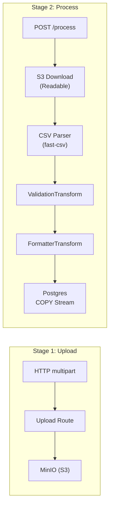

# Stream API

Memory-safe batch data ingestion API. Processes multi-GB CSV files in a 512 MB container using Node.js Streams, backpressure, and PostgreSQL COPY protocol. Built with Fastify, manual composition root (no DI framework).

## KPIs

| Metric             | Target            | Achieved                     |
| ------------------ | ----------------- | ---------------------------- |
| Container Memory   | 512 MB limit      | **57 MB average**            |
| Throughput         | > 10,000 rows/sec | **48,700 rows/sec**          |
| Data Consistency   | 100%              | **5M CSV rows = 5M DB rows** |
| Unit Test Coverage | 80%+              | **98.67%** (60 tests)        |

## Architecture



**Pipeline:** `stream.pipeline(s3Stream, csvParser, validationTransform, formatterTransform, pgCopyStream)`

## API Reference

### `POST /upload`

Upload a CSV file to object storage. Streams directly from HTTP to S3 (no disk, no memory buffer).

**Query params:** `callbackUrl` (optional) — URL to POST completion webhook.

**Response:** `202 Accepted`

```json
{
  "uploadId": "a1b2c3d4-...",
  "objectKey": "uploads/a1b2c3d4-...",
  "status": "uploaded",
  "location": "/upload/a1b2c3d4-.../process"
}
```

### `POST /upload/:uploadId/process`

Download from S3, run the transform pipeline, bulk insert via COPY, delete from S3.

**Response:** `200 OK`

```json
{
  "success": true,
  "uploadId": "a1b2c3d4-...",
  "rowsProcessed": 5000000,
  "rowsInvalid": 0
}
```

### `GET /upload/:uploadId/status`

Poll processing status. Returns the current state without the `callbackUrl`.

**Response:** `200 OK`

```json
{
  "uploadId": "a1b2c3d4-...",
  "status": "completed",
  "rowsProcessed": 5000000,
  "rowsInvalid": 0
}
```

### `GET /health`

**Response:** `200 OK` `{ "status": "ok" }`

## Service Classes

| Service           | Responsibility                                                               |
| ----------------- | ---------------------------------------------------------------------------- |
| `StorageService`  | S3/MinIO upload, download, and delete (streaming)                            |
| `DatabaseService` | PostgreSQL pool + COPY stream creation for `webhook_events`                  |
| `RedisClient`     | ioredis connection (injected into StatusService)                             |
| `StatusService`   | Redis CRUD for upload status records (7-day TTL)                             |
| `WebhookQueue`    | BullMQ queue for webhook delivery callbacks (3 retries, exponential backoff) |
| `WebhookWorker`   | BullMQ worker — POSTs JSON payload to user's `callbackUrl`                   |
| `MemoryMonitor`   | Logs v8 heap stats every 5s, warns at > 400 MB                               |

### Composition Root (`server.ts`)

Services are instantiated manually and injected via Fastify decoration:

```typescript
app.decorate('storageService', storageService);
app.decorate('statusService', statusService);
app.decorate('webhookQueue', webhookQueue);
app.decorate('databaseService', databaseService);
```

Graceful shutdown tears down services in reverse creation order.

## Transform Pipeline

| Stage | Class                 | Mode                | Purpose                                                                             |
| ----- | --------------------- | ------------------- | ----------------------------------------------------------------------------------- |
| 1     | `ValidationTransform` | objectMode, hwm=100 | Validates required fields (provider, eventId, timestamp, data). Skips invalid rows. |
| 2     | `FormatterTransform`  | objectMode, hwm=100 | Converts validated rows to CSV lines with RFC 4180 escaping for COPY.               |

**Backpressure:** `stream.pipeline()` automatically pauses the S3 source when the Postgres COPY stream is slow.

## Notification System

1. On upload: status record created in Redis (`status:<uploadId>`)
2. On process start: status updated to `processing`
3. On completion/failure: status updated to `completed`/`failed`
4. If `callbackUrl` provided: webhook job enqueued in BullMQ → Worker POSTs result

## Configuration

| Variable        | Default           | Description           |
| --------------- | ----------------- | --------------------- |
| `PORT`          | `3002`            | HTTP listen port      |
| `DB_HOST`       | `localhost`       | PostgreSQL host       |
| `DB_PORT`       | `5432`            | PostgreSQL port       |
| `DB_USER`       | `dev_user`        | PostgreSQL user       |
| `DB_PASSWORD`   | `dev_password`    | PostgreSQL password   |
| `DB_NAME`       | `distributed_lab` | PostgreSQL database   |
| `REDIS_HOST`    | `localhost`       | Redis host            |
| `REDIS_PORT`    | `6379`            | Redis port            |
| `S3_ENDPOINT`   | —                 | S3/MinIO endpoint URL |
| `S3_REGION`     | `us-east-1`       | S3 region             |
| `S3_ACCESS_KEY` | —                 | S3 access key         |
| `S3_SECRET_KEY` | —                 | S3 secret key         |
| `S3_BUCKET`     | —                 | S3 bucket name        |

## Development

```bash
# Prerequisites: Docker services running
pnpm docker:up

# Watch mode
pnpm dev

# Build (tsup)
pnpm build

# Generate test CSV (5M rows)
pnpm generate:csv
```

## Testing

```bash
# Unit tests (Vitest)
pnpm test

# Watch mode
pnpm test:watch

# Coverage report
pnpm test:cov
```

### Test Structure

12 spec files colocated with source (`src/**/*.spec.ts`):

- **Transforms:** `validation.spec.ts`, `formatter.spec.ts` — pure logic, no mocks
- **Services:** `storage.service.spec.ts`, `postgres-writer.spec.ts`, `status.service.spec.ts`, `redis.client.spec.ts`, `webhook.queue.spec.ts`, `webhook.worker.spec.ts`, `memory.spec.ts`
- **Routes:** `upload.spec.ts`, `process.spec.ts`, `status.spec.ts` — Fastify inject

## Docker

```bash
# Via docker compose (512 MB memory limit)
docker compose up stream-api

# Standalone
docker build -f apps/stream-api/Dockerfile -t stream-api .
docker run --memory=512m -p 3002:3002 stream-api
```

`NODE_OPTIONS=--max-old-space-size=450` leaves headroom below the 512 MB container limit.

## Key Decisions

- [ADR-0005: Object Storage for Stream API](../../docs/adr/0005-use-object-storage-for-stream-api-uploads.md)
- [ADR-0006: Postgres COPY Protocol](../../docs/adr/0006-use-postgres-copy-protocol-for-bulk-inserts.md)
- [ADR-0007: Notification System](../../docs/adr/0007-notification-system-for-stream-api.md)
- [ADR-0008: OOP Refactor & Import Aliases](../../docs/adr/0008-stream-api-oop-refactor-and-import-aliases.md)
