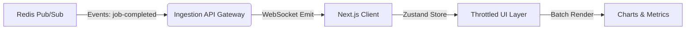

# Dashboard's spec

## 1. Project Manifesto & Goals

**Project Name:** `live-dashboard` (Apps Layer)
**Type:** Real-Time Analytics & Data Visualization
**Objective:** Build a high-performance dashboard that visualizes the ingestion throughput from the Ingestion API in real-time. It must render high-frequency updates (50+ events/sec) without freezing the UI.

**Primary KPIs:**

1.  **Rendering Performance:** Maintain 60 FPS while receiving 100+ WebSocket events/second.
2.  **Latency:** < 200ms from "Job Processed" (Backend) to "Pixel on Screen" (Frontend).
3.  **Resilience:** Auto-reconnect sockets upon network failure.

---

## 2. Tech Stack & Constraints

- **Framework:** Next.js 14+ (App Router).
- **State Management:** Zustand (for high-frequency state updates outside React Context).
- **Real-Time:** Socket.io Client.
- **Visualization:** Recharts (optimized) or Visx.
- **Styling:** TailwindCSS + Shadcn/UI.
- **Shared Contracts:** Must import types from `@repo/dto`.
- **Linting:** Must extend `@repo/eslint-config/next`.

**AI Agent Directive:** Do not use `useEffect` for high-frequency socket listeners; use refs or external stores (Zustand) to prevent unneeded re-renders. Implement "Throttling" for UI updates.

---

## 3. Architecture Overview

## 4. Module Specifications

### Module A: The Socket Integration

**Role:** The Bridge. It connects to the Socket Gateway (hosted inside `ingestion-api`).
**Components:**

1. **Typed Socket:** Create a strict socket client using shared types from `@repo/dto`.
2. **Connection Manager:** Global singleton to handle connection/reconnection/backoff.

#### Module B: The Frontend Core

**Role:** High-Performance Rendering.
**Components:**

1. **Store (Zustand):** Holds the "Buffer" of recent events.
   - _Critical:_ Do not trigger a re-render for every single event. Update the store, and use a `useInterval` hook or `requestAnimationFrame` to update the UI at max 30fps or 60fps.
2. **Components:**
   - `ThroughputChart`: Line chart showing Requests Per Second (RPS).
   - `LiveLogStream`: A virtualized list (TanStack Virtual) showing the last 100 logs. Do not render a standard `<ul>` list, it will crash the browser under load.

## 5. Acceptance Criteria (The "Freeze" Test)

### Scenario:

1. Run `ingestion-api` load test (500 users).
2. Open Dashboard.

### Pass Condition:

1. Chrome DevTools "Performance Monitor" shows CPU usage < 70%.
2. UI is responsive (buttons click immediately) while the chart updates.
3. Stop Project 1. Chart goes to zero. Restart Project 1. Chart recovers immediately.
