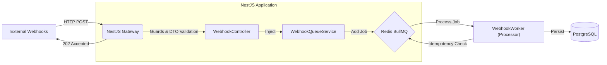

# Webhook Ingestor's spec

## 1. Project Manifesto & Goals

**Project Name:** `webhook-ingestor-enterprise`
**Type:** High-Throughput Event Ingestion
**System Objective:** Engineer a fault-tolerant API gateway using Enterprise Standards (NestJS) capable of handling 10k+ requests/second, ensuring maintainability and scalability.

### Primary KPIs:

1. **Availability:** 99.99% uptime.
2. **Architecture:** Strict Modular Architecture (Separation of Concerns).
3. **Performance:** NestJS configured with FastifyAdapter (Not Express).

## 2. Tech Stack & Constraints (Hard Rules)

- **Framework:** NestJS 10+ (Enterprise Standard).
- **Platform:** Fastify Adapter (for Performance).
- **Language:** TypeScript 5.x (Strict Mode).
- **Queue System:** BullMQ (via `@nestjs/bullmq`).
- **Database:** PostgreSQL 16+.
- **ORM:** Drizzle ORM (configured via Dynamic Module).
- **Validation:** `class-validator` + `class-transformer` (DTO Pattern).
- **Testing:** Vitest (Unit) + K6 (Load Testing).
- **Logging:** `nestjs-pino` (JSON Structured Logs for observability).
- **Security:**
  - `helmet`: Enabled for HTTP Header security.
  - `cors`: Restricted to specific domains (configurable via ENV).
  - `rate-limit`: Fastify native rate-limiting enabled globally.

**AI Agent Directive:** strictly follow NestJS architectural patterns (Modules, Controllers, Providers, Guards). Do not write "spaghetti code" inside controllers.

## 3. Architecture Overview



### 3.1. Infrastructure Blueprint (Docker Compose)

**Objective:** define the exact environment for local development and CI testing.

#### Service A: Database (Postgres)

- **Image:** `postgres:16-alpine` (Lightweight & Stable).
- **Ports:** `5432:5432` (Host:Container).
- **Volumes:** `./.docker/postgres-data:/var/lib/postgresql/data` (**Critical:** Data Persistence).
- **Healthcheck:** `pg_isready -U user` (Ensures NestJS waits for DB readiness).

#### Service B: Queue Engine (Redis)

- **Image:** `redis:7-alpine`.
- **Ports:** `6379:6379`.
- **Command:** `redis-server --appendonly yes` (AOF Persistence enabled for data safety).
- **Volumes:** `./.docker/redis-data:/data`.

#### Service C: NestJS Application (API & Worker)

- **Build:** `Dockerfile` (Multi-stage build: Base -> Deps -> Builder -> Runner).
- **Env File:** Read from `.env`.
- **Depends_on:** Postgres and Redis (Condition: `service_healthy`).

## 4. Module Specifications

### Core Module: `AppModule`

- **ConfigModule:** Global load of `.env`.
- **DatabaseModule:** Global connection to Postgres (Drizzle).
- **BullModule:** Global connection to Redis.

### Module A: `WebhookModule` (API Layer)

**Role:** Ingress point.
**Components:**

1. DTO (`CreateWebhookDto`): Defines the expected payload structure using decorators (e.g., `@IsString()`, `@IsNotEmpty()`).
2. Controller:

- Endpoint: POST `/webhooks/:provider`.
- Use `FastifyRequest` for low-level access if needed.
- Return type: `void` (handled by Fastify reply) or `{ accepted: true, jobId }`.

3. Service: Responsible only for injecting the Queue and adding the job.

### Module B: `WorkerModule` (Processor Layer)

**Role:** Asynchronous processing.
**Components:**

1. **Processor** (`@Processor('webhooks')`):

- Method `@Process('ingest')`.
- Logic: Idempotency Check -> DB Insert -> Ack.

2. **Idempotency:** Implement a `RedisService` or use standard caching to check if `job.data.eventId` was already processed.

- **CRITICAL:** Set a TTL (e.g., 24h) for these keys to prevent Redis memory leaks.

### Module C: `HealthModule` (Ops Layer)

**Role:** K8s Liveness & Readiness Probes.
**Components:**

1. **Terminus:** Use `@nestjs/terminus` to expose the endpoint `GET /health`.
2. **Checks:**

- **DB Health:** Ping on Postgres (if fails, the pod will restart).
- **Redis Health:** Ping on Redis.
- **Memory Heap:** Check that we are not exceeding the RAM limit.

### Module D: `SharedModule` (Kernel Layer)

**Role:** Type Safety & Utilities.
**Components:**

1. **Interfaces:** Export the `WebhookJobData` interface here. Both the `WebhookModule` (which produces the data) and the `WorkerModule` (which consumes it) must import this interface from this module to ensure that the data contract is identical.
2. **Constants:** Queue names ('webhooks') and injection tokens.

## 5. Development Phases (Prompt Strategy)

### Phase 1: Setup NestJS with Fastify

> "Act as a Senior Node.js Architect. Initialize a new NestJS project structure (monorepo style is optional, standard is fine). CRITICAL: Configure the project to use `FastifyAdapter`. Setup nestjs-pino for structured JSON logging immediately. Setup `docker-compose.yml` with Redis and Postgres."

### Phase 2: Database & Drizzle Module

> "Create a `DatabaseModule` in NestJS that connects to Postgres using Drizzle ORM. Define the `WebhookSchema` in Drizzle. Implement the `ConfigModule` to read DB credentials from `.env`."

### Phase 3: Queue Configuration

> "Setup `@nestjs/bullmq`. Configure the `BullModule.forRootAsync` in `AppModule` to connect to Redis. Create a `WebhookQueueModule` that registers a queue named 'webhooks'."

### Phase 4: API Implementation (Controller + DTO)

> "Implement the `WebhookController`. 1. Create a `CreateWebhookDto` using `class-validator`. 2. In the controller, inject the Queue. 3. The POST endpoint must validate the DTO, add a job to BullMQ, and return 202 immediately."

### Phase 5: Processor Logic

> "Implement the Worker. Create a class decorated with `@Processor('webhooks')`. Implement a method `@Process()` that simulates processing. Add logic to insert data into Drizzle/Postgres. Handle graceful shutdown."

## 6. The Acceptance Criteria

This section defines the "Definition of Done". The project is only considered complete when all criteria below are met and documented.

### 6.1 Runtime Verification

**Objective:** Ensure the application is actually running on the High-Performance Adapter, not the default Express.

1. Start the application: `npm run start:dev`.
2. Inspect terminal logs.
3. **Pass Condition:** You must see specific Fastify initialization logs.

- **Success:** `[NestFactory] Starting Nest application...` followed by logs indicating `FastifyAdapter` or implicit Fastify behavior.
- **Error:** If you see `ExpressAdapter` or references to `body-parser`.

### 6.2 Architecture Integrity Check

**Objective:** Validate strict separation of concerns (NestJS Standard).

1. **Controller:** Must NOT contain any business logic (calculations, DB calls). It should only validate DTOs and call `QueueService.addJob()`.
2. **Worker:** Must be properly decoupled. If you stop the NestJS app, the Redis queue should hold the jobs until the app restarts (Persistence Check).

### 6.3 Load Testing (The 10k Challenge)

**Objective:** Prove the system handles spikes without crashing or losing data.

#### Run the test:

```bash
k6 run load-test.js
```

#### Success Metrics (KPIs):

- **Throughput:** System must handle 500 Virtual Users (VUs) simultaneously.
- **Error Rate:** HTTP Failed requests must be **< 1%** (ideally 0%).
- **Latency (P95):** API Response (202 Accepted) must be **< 100ms**. Note: _We measure ingestion speed, not processing speed_.
- **Data Consistency:** `Total Requests Sent (K6)` == `Rows in Postgres`.

### Appendix: The Load Script (`load-test.js`)

Save this file in the root directory or tests/ folder.

```javascript
import http from 'k6/http';
import { check, sleep } from 'k6';
import { randomString } from 'https://jslib.k6.io/k6-utils/1.2.0/index.js';

export const options = {
  stages: [
    { duration: '10s', target: 50 }, // Warm up
    { duration: '1m', target: 500 }, // ⚠️ STRESS SPIKE: 500 concurrent users
    { duration: '10s', target: 0 }, // Cool down
  ],
  thresholds: {
    http_req_failed: ['rate<0.01'], // Max 1% errors allowed
    http_req_duration: ['p(95)<100'], // 95% of requests must accept in under 100ms
  },
};

export default function () {
  // Payload simulating a Stripe/Payment Provider Webhook
  const payload = JSON.stringify({
    provider: 'stripe',
    eventId: `evt_${randomString(12)}`, // Unique ID for Idempotency check
    timestamp: new Date().toISOString(),
    data: {
      amount: Math.floor(Math.random() * 10000),
      currency: 'brl',
      customer_id: `cus_${randomString(8)}`,
      status: 'succeeded',
    },
  });

  const params = {
    headers: {
      'Content-Type': 'application/json',
    },
  };

  // Ensure this URL matches your NestJS Docker container or Localhost port
  const res = http.post('http://localhost:3000/webhooks/stripe', payload, params);

  // Assertions
  check(res, {
    'status is 202': (r) => r.status === 202, // Must be Accepted, not 200 OK
  });

  // Pacing: Random sleep to simulate real traffic variance
  sleep(0.1);
}
```
