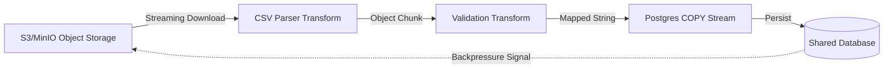

# Stream API Spec

## 1. Project Manifesto & Goals

**Project Name:** `stream-api` (Apps Layer)
**Type:** Batch Data Ingestion API
**Objective:** Process massive CSV datasets (2GB+) inside a container with restricted RAM (512MB), demonstrating mastery of Node.js Streams, Backpressure, and Garbage Collection.

**Primary KPIs:**

1.  **Memory Safety:** Process memory (RSS) must never exceed 512MB, regardless of file size.
2.  **Throughput:** Process > 10,000 rows/second.
3.  **Backpressure:** The system must pause reading the file if the Database Write stream becomes slow.

---

## 2. Tech Stack & Constraints

- **Runtime:** Node.js 20+ (Streams API).
- **Framework:** Fastify (Multipart support).
- **Object Storage:** AWS S3 or MinIO (S3-compatible) for temporary file storage.
- **Parsing:** `csv-parser` or `fast-csv` (Streaming parser).
- **Database:** PostgreSQL (Connection via `@distributed-systems-lab/database`).
- **Optimization:** `pg-copy-streams` (Use Postgres COPY protocol, not standard INSERTs).

**AI Agent Directive:** strictly FORBID usage of `fs.readFileSync` or loading the whole array into memory. All operations must be piped (`.pipe()`) or use `stream.pipeline()`. Use object storage (S3/MinIO) for temporary file storage to enable retry mechanisms and avoid network failure issues.

---

## 3. Architecture Overview (Two-Stage Pipeline)

The system uses a two-stage pipeline to handle network reliability and enable retry mechanisms:

**Stage 1: HTTP → Object Storage (Upload)**

**Stage 2: Object Storage → Database (Processing)**

**Complete Flow:**
1. Client uploads file via HTTP POST (optionally provides `callbackUrl`)
2. Fastify streams upload directly to S3/MinIO (no local disk)
3. Return HTTP 202 Accepted immediately after upload completes with `uploadId`
4. Process file asynchronously: Stream from S3 → Parse → Validate → Database
5. Update processing status (uploaded → processing → completed/failed)
6. Send notification (webhook callback if provided, or user polls status endpoint)
7. Delete object from S3 after successful processing

**Benefits:**
- **Network Reliability:** Upload completes before processing starts
- **Retry Mechanism:** Can retry processing without re-uploading entire file
- **No Local Disk:** Uses object storage instead of container filesystem
- **Horizontal Scaling:** Multiple instances can process same file
- **Memory Constraint:** Still maintains 512MB RAM limit (streaming operations)

## 4. Module Specifications

### Module A: Upload Controller (Stage 1)

**Role:** Handle HTTP file upload and stream to object storage.
**Logic:**

1. Receive multipart file upload via Fastify
2. Accept optional `callbackUrl` parameter in request body/form-data
3. Stream HTTP request directly to S3/MinIO using `@aws-sdk/lib-storage` Upload class
4. Generate unique upload ID and object key for tracking
5. Store upload metadata (uploadId, callbackUrl, status: 'uploaded') in database/Redis
6. Return HTTP 202 Accepted immediately after upload completes with `{ uploadId, status: 'uploaded' }`

**Key Implementation:**
- Use `Upload` class from `@aws-sdk/lib-storage` for streaming uploads
- No local disk writes - stream directly from HTTP to S3
- Handle upload errors gracefully (cleanup object on failure)
- Validate `callbackUrl` format if provided (must be valid HTTP/HTTPS URL)

### Module B: Processing Controller (Stage 2)

**Role:** Orchestrate database processing pipeline and notifications.
**Logic:**

1. Update status to 'processing' in database/Redis
2. Stream file from S3/MinIO using `GetObjectCommand`
3. Initialize `pipeline(source, transform, destination)` for processing
4. Track progress (rows processed, errors encountered)
5. Handle `error` events at any stage to prevent "Unhandled Promise Rejection"
6. On completion:
   - Update status to 'completed' or 'failed' with result metadata
   - Trigger notification (webhook callback if provided)
   - Delete object from S3 after successful processing
7. Return processing result (success/failure with row count)

**Status Tracking:**
- Store processing status: `uploaded` → `processing` → `completed` | `failed`
- Include metadata: `rowsProcessed`, `rowsFailed`, `error?`, `startedAt`, `completedAt`

### Module C: The Transform Layers

**Role:** ETL (Extract, Transform, Load).
**Components:**

1. **CSV Parser Transform:** Streaming CSV parser (`fast-csv` or `csv-parser`) that converts raw bytes to JavaScript objects
2. **Validation Transform:** A `Transform` stream that validates required fields, cleans data, formats dates, and drops invalid rows
3. **Postgres Formatter Transform:** Converts objects to CSV format expected by Postgres `COPY` command (proper escaping)

### Module D: Object Storage Service

**Role:** Abstract S3/MinIO operations.
**Components:**

1. **Upload Service:** Stream HTTP file to object storage
2. **Download Service:** Stream object from storage for processing
3. **Cleanup Service:** Delete objects after successful processing
4. **Retry Service:** Enable retry of failed processing jobs

**Implementation:**
- Use `@aws-sdk/client-s3` for AWS S3
- Use `minio` client for local development (S3-compatible)
- Support both production (S3) and development (MinIO) environments

### Module F: Notification System

**Role:** Provide status updates and webhook callbacks.

**Components:**

1. **Status Endpoint:** `GET /upload/:uploadId/status`
   - Returns current processing status and metadata
   - Status values: `uploaded`, `processing`, `completed`, `failed`
   - Includes: `rowsProcessed`, `rowsFailed`, `progress?`, `error?`, `startedAt`, `completedAt`

2. **Webhook Service:**
   - POST to user's `callbackUrl` when processing completes/fails
   - Payload: `{ uploadId, status, rowsProcessed, rowsFailed?, error?, timestamp }`
   - Retry mechanism: Exponential backoff (max 3 retries)
   - Queue webhook delivery for async processing (BullMQ or similar)

3. **Status Storage:**
   - Store processing status in PostgreSQL or Redis
   - Key: `uploadId`, TTL: 7 days (cleanup old statuses)
   - Include all metadata for status endpoint

**Implementation:**
- Use Redis for status storage (fast, TTL support) or PostgreSQL (persistent)
- Use BullMQ or similar queue for webhook delivery (retryable, async)
- Validate callbackUrl format (must be HTTP/HTTPS)
- Handle webhook failures gracefully (log, retry, don't block processing)

### Module G: Infrastructure (Constraints)

**Docker Compose Configuration:**

- **Hard Limit:** Set `deploy.resources.limit.memory: 512M` in root `docker-compose.yml` for this service. This is the **Proof of Work**.
- **Object Storage:** Add MinIO service for local development (S3-compatible)
  - Ports: 9000 (API), 9001 (Console)
  - Persistent volume for object storage data
- **Queue System:** Redis (shared with other services) for webhook delivery queue

## 5. Acceptance Criteria (The OOM Test)

### Scenario:

1. Generate a dummy CSV file with 5 million rows (approx. 1GB).
2. Send via `curl` to the API: `curl -X POST -F "file=@large.csv" http://localhost:3002/upload`
3. Monitor Docker State: `docker stats stream-api`
4. Verify object storage: Check MinIO console (http://localhost:9001) for uploaded file

### Pass Condition:

1. **Upload Stage:**
   - HTTP 202 Accepted returned immediately after upload completes
   - File visible in object storage (S3/MinIO)
   - Memory usage during upload: ~16-64KB buffer (streaming upload)

2. **Processing Stage:**
   - Memory: Container RAM usage stays flat (e.g., oscillating between 100MB~200MB) and does NOT grow linearly
   - Completion: Returns HTTP 200 only after all rows are in DB
   - Database: `SELECT COUNT(*) FROM webhook_events` matches the CSV row count
   - Cleanup: Object deleted from S3/MinIO after successful processing

3. **Retry Mechanism:**
   - If processing fails, object remains in storage
   - Can retry processing via `/upload/:uploadId/retry` endpoint without re-uploading
   - Retry succeeds and processes all rows correctly

4. **Notification System:**
   - Status endpoint returns current processing status: `GET /upload/:uploadId/status`
   - Webhook callback (if provided) receives POST when processing completes/fails
   - Webhook retry mechanism handles temporary failures (max 3 retries)
   - Status persists for 7 days for user reference
