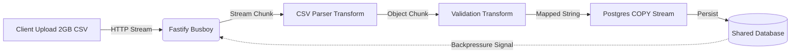

# Stream Engine's Spec

## 1. Project Manifesto & Goals

**Project Name:** `stream-engine` (Apps Layer)
**Type:** Low-Level Node.js Data Processing
**Objective:** Process massive CSV datasets (2GB+) inside a container with restricted RAM (512MB), demonstrating mastery of Node.js Streams, Backpressure, and Garbage Collection.

**Primary KPIs:**

1.  **Memory Safety:** Process memory (RSS) must never exceed 512MB, regardless of file size.
2.  **Throughput:** Process > 10,000 rows/second.
3.  **Backpressure:** The system must pause reading the file if the Database Write stream becomes slow.

---

## 2. Tech Stack & Constraints

- **Runtime:** Node.js 20+ (Streams API).
- **Framework:** Fastify (Multipart support).
- **Parsing:** `csv-parser` or `fast-csv` (Streaming parser).
- **Database:** PostgreSQL (Connection via `@repo/database`).
- **Optimization:** `pg-copy-streams` (Use Postgres COPY protocol, not standard INSERTs).

**AI Agent Directive:** strictly FORBID usage of `fs.readFileSync` or loading the whole array into memory. All operations must be piped (`.pipe()`) or use `stream.pipeline()`.

---

## 3. Architecture Overview (The Pipeline)

## 4. Module Specifications

### Module A: The Stream Controller

**Role:** Orchestrator.
**Logic:**

1. Initializa `pipeline(source, transform, destination, callback)`.
2. Handle `error` events at any stage to prevent "Unhandled Promise Rejection" which crashes Node process.

### Module B: The Transform Layers

**Role:** ETL (Extract, Transform, Load).
**Components:**

1. **Sanitization Transform:** A `Transform` stream that cleans emails, formats dates and drop invalid rows.
2. **NDJSON/CSV Formatter:** Converts the object back to the format expected by Postgres `COPY`command.

### Module C: Infrastructure (Constraints)

**Docker Compose Configuration:**

- **Hard Limit:** Set `deploy.resources.limit.memory: 512M` in root `docker-compose.yml` for this service. This is the **Proof of Work**.

## 5. Acceptance Criteria (The OOM Test)

### Scenario:

1. Generate a dummy CSV file with 5 million rows (approx. 1GB).
2. Send via `curl` to the API.
3. Monitor Docker State.

### Pass Condition:

1. **Memory:** Container RAM usage stays flat (e.g., oscilating between 100MB~200MB) and does NOT grow linearly.
2. **Completion:** Returns HTTP 200 only after all rows are in DB.
3. **Database:** `SELECT COUNT(*)` matches the CSV row count.
